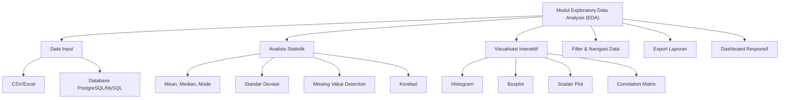

# RANTAI EXPLODA

Selamat datang di repository modul Exploratory Data Analysis (EDA), bagian dari platform analytics end-to-end yang fokus pada eksplorasi dan pemahaman data secara mendalam. Modul ini memfasilitasi analisis statistik dan visualisasi interaktif untuk membantu pengguna menemukan pola, anomali, dan insight awal dari data.

---

## Tentang

Modul EDA menyediakan alat analitik awal untuk memahami dan memastikan kualitas data sebelum diteruskan ke tahap bisnis intelligence. Melalui visualisasi interaktif dan statistik deskriptif, pengguna dapat mengidentifikasi distribusi data, missing value, korelasi, dan pola multivariabel dengan mudah.

> Visi: Mewujudkan proses eksplorasi data yang cepat, mudah, dan menyeluruh untuk meningkatkan pemahaman data sebagai dasar analisis lanjutan.

---

## Fitur

- Import data dari format CSV, Excel, dan database PostgreSQL/MySQL

- Analisis statistik deskriptif otomatis (mean, median, mode, standar deviasi, missing value)

- Visualisasi interaktif: histogram, boxplot, scatter plot, correlation matrix

- Filter dan navigasi data untuk eksplorasi multivariabel

- Export hasil analisis dan visualisasi ke format PDF/HTML

- Dashboard responsif untuk analyst data



---

## Instalasi

Prasyarat
- Python >= 3.9

- Node.js >= 18.x (untuk frontend)

- PostgreSQL atau MySQL (opsional)

Langkah Instalasi
1. Clone repository ini:
```bash
git clone https://github.com/mrbrightsides/rantai-exploda.git
cd eda-module
```

2. Instal dependensi backend dan frontend:
```bash
pip install -r requirements.txt
cd frontend && npm install
```

3. Konfigurasi database di file .env

4. Jalankan backend dan frontend:
```bash
uvicorn main:app --reload
```
Frontend (React/Vue):
```bash
npm start
```

## Penggunaan

- Akses dashboard EDA di https://rantai-exploda.streamlit.app/

- Unggah dan eksplorasi dataset menggunakan fitur statistik dan visualisasi

- Simpan dan ekspor laporan hasil eksplorasi

---

##Teknologi

- Backend: Python (FastAPI), pandas, numpy

- Frontend: React/Vue, D3.js, Plotly.js

- Database: PostgreSQL/MySQL (opsional)

---

## Kontribusi
Silakan lakukan fork, buat branch, commit perubahan, dan ajukan pull request sesuai standar kontribusi proyek.

- Fork repository

- Buat branch fitur baru: git checkout -b feature/nama-fitur

- Commit perubahan Anda: git commit -m 'Tambah fitur baru'

- Push ke branch Anda: git push origin feature/nama-fitur

- Buat pull request di repository ini

- Harap pastikan kode teruji dan mengikuti style yang sudah ada.

## Lisensi

Berlisensi MIT. Lihat file LICENSE untuk informasi lengkap.
